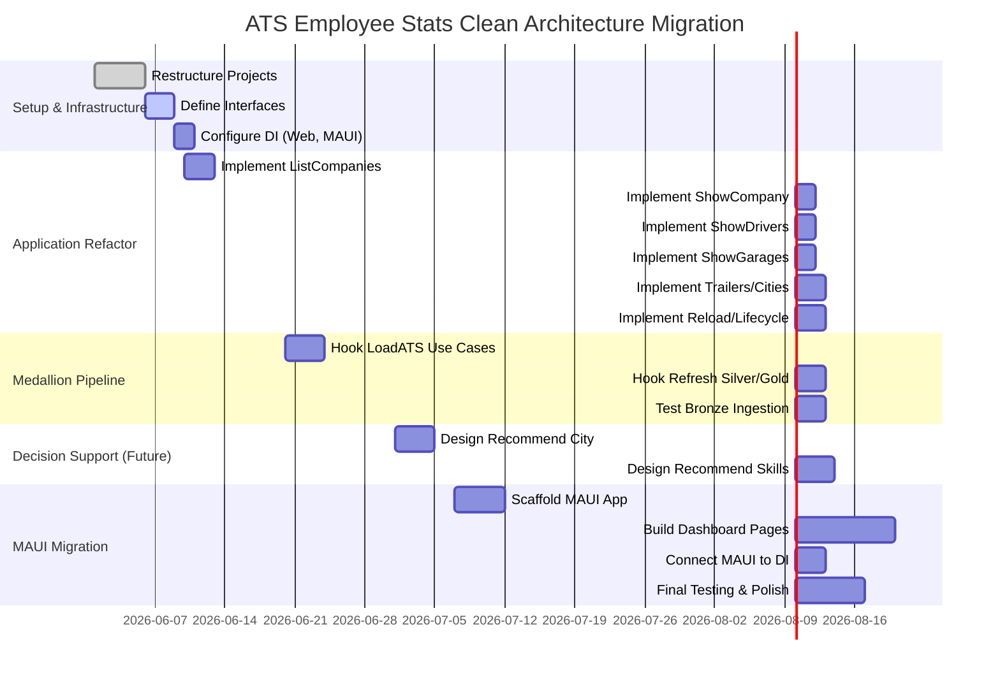

# Executive Summary  
The **ats-employee-stats** app currently mixes concerns across its API, application logic, and data layers. The codebase spans projects for Domain models, Application services, Infrastructure (SQLite persistence), and API controllers (Minimal APIs). Core domain types (e.g. `AtsStatistics`, `CompanyStatistics`, etc.) are defined in the Domain layer【60†L0-L9】. The application layer contains services like `StatisticsService` that perform save-file ingestion and projection【58†L28-L36】. The API (in `Program.cs`) defines endpoints (“use cases”) for listing companies, drivers, garages, etc.【52†L70-L79】【52†L81-L90】. Infrastructure (e.g. `SqliteMedallionSaveSnapshotSource`) implements a **medallion pipeline** (bronze/silver/gold) to cache raw saves and compute aggregates; it ingests new game saves and updates silver and gold tables via calls like `PersistSilverAndGoldAsync`【59†L1-L4】. 

In its current form, the code violates strict Clean Architecture principles: controllers contain logic (filtering, mapping), there are no explicit “use case” interactor classes or presenters, and dependency rules are not enforced (e.g. API layer directly uses domain and infrastructure). We propose refactoring to a **minimal Clean Architecture** (Domain, Application, Interface-Adapters, Infrastructure) with well-defined dependencies inward【56†L2090-L2097】. This involves extracting use cases into separate interactor classes, defining repository (gateway) interfaces, and separating presentation (controllers/presenters) from business logic. We will preserve existing behavior (especially the medallion loading pipeline) while reorganizing code, then in a later phase replace the web UI with a .NET MAUI desktop app using a local SQLite file (in `%LOCALAPPDATA%`)【63†L101-L104】.  

Key deliverables of the migration plan include:  
- **Inventory & mapping:** Document current projects/layers and how they correspond to Clean layers.  
- **Use case catalog:** Enumerate all existing and planned use cases: data loading (LoadATS, LoadETS2, find paths/saves), data refresh (refresh silver/gold), data queries (list companies, company by id, drivers, garages, trucks, trailers, cities, routes), plus decision-support cases (recommend city, recommend trailers, recommend skills, diagnose underperformers).  
- **Clean Architecture design:** Define Interface-Adapater layer (Controllers, Presenters/DTOs), Application layer (Use Case Interactors), Domain layer (entities/logic), Infrastructure (gateway implementations). Provide sample C# interface signatures (e.g. `IGarageRepository`) and one full interactor (e.g. a `ShowGarages` use case).  
- **Project structure:** Suggest a solution layout (e.g. `AtsEmployeeStats.Domain`, `.Application`, `.Infrastructure`, `.Api` (or `.Web`), `.Maui`).  
- **Data access & DI:** Show how to wire repositories and services via `IServiceCollection` in both the current web app and the future MAUI app (using `Microsoft.Data.Sqlite` for SQLite). Include a migration strategy for the SQLite DB (e.g. creating tables if not exist as already done by `EnsureSchemaAsync`).  
- **Testing strategy:** Outline unit tests for domain and application logic and integration tests for data layer (e.g. using an in-memory SQLite).  
- **Incremental plan:** Provide step-by-step tasks (with low/med/high effort) to reach strict Clean Architecture. Include a timeline (Mermaid Gantt chart) and tables comparing current vs target files/layers.  

Through this plan we will “pull” all logic toward the interior, ensuring that controllers only orchestrate use cases and presenters format outputs, that use cases know only the domain and repository interfaces, and that infrastructure implements these interfaces. In doing so, we preserve the proven medallion data pipeline (bronze ingestion, silver normalization, gold queries) while making the codebase modular, testable, and ready for a MAUI-based UI.  

## 1. Current Project Inventory  
The solution currently contains these key projects:  

| Project (Folder)                       | Contents/Roles                                        | Clean Layer (target)         |
|----------------------------------------|-------------------------------------------------------|------------------------------|
| **AtsEmployeeStats.Domain**            | *Domain models*: SaveSnapshot, SiiDocument, `AtsStatistics`, `CompanyStatistics`, etc.【60†L0-L9】. No external dependencies. | **Domain**                    |
| **AtsEmployeeStats.Application**       | *Application services and logic*: `StatisticsService` (load/ingest saves), `StatisticsProjection` (builds domain stats), mapping (e.g. `StatisticsDashboardMapper`). Contains use-case logic embedded in services but no I/O code. | **Application (Use Cases)**  |
| **AtsEmployeeStats.Infrastructure**    | *Persistence*: `SqliteMedallionSaveSnapshotSource` (implements `ISaveSnapshotSource`, `IStatisticsQuerySource`, `IStatisticsIngestor`), which handles medallion tables (creates bronze/silver/gold tables, ingestion, queries)【59†L1-L4】. Relies on `Microsoft.Data.Sqlite`. | **Infrastructure (Data Gateways)**  |
| **AtsEmployeeStats.Contracts**         | *DTO definitions*: Records for Dashboard, CompanyDto, DriverDto, etc.【39†L0-L8】. These mirror parts of `AtsStatistics` and related types, used for serialization to the UI. Currently shared between layers. | **Interface Adapters (DTOs)** |
| **AtsEmployeeStats.Api (Web)**         | *Presentation*: Minimal APIs in `Program.cs` define REST endpoints (controllers)【52†L70-L79】【52†L81-L90】 and a SignalR Hub. Also `SaveIngestionService` (background ingestion on startup) and endpoint-to-DTO mapping (via `StatisticsDashboardMapper`). It directly injects `StatisticsService` and returns results. | **Interface Adapters (Controllers)**  |
| **(Tests)**                            | Unit tests for various layers (includes tests for SQLite ingestion, CLI, etc.). | 

**Current Use of Layers:** The API layer (`Program.cs`) directly calls `StatisticsService.LoadAsync`/`IngestAsync` and then uses application mappers to return DTOs【52†L70-L79】【58†L28-L36】. The application layer has no explicit “Use Case” classes – the `StatisticsService` is essentially the interactor for load/reload. Infrastructure is implemented by one heavy class handling all DB work. Domain contains only data (no business logic besides being data carriers).

## 2. Existing and Required Use Cases  
Based on the code and goals, we enumerate **all use cases** (features) to cover. These split into data ingestion (medallion), standard queries, and new decision-support functions:

- **Installation & Save Discovery:**  
  - *FindATSData* (locate ETS/ATS installation directory on disk)  
  - *FindETS2Data*  
  - *FindATSSaveGames* (find saved `game.sii` files)  
  - *FindETS2SaveGames*  

- **Data Loading (Bronze):**  
  - *LoadATSData* – Ingest all ATS saves into SQLite bronze cache (game files→bronze tables)【59†L1-L4】.  
  - *LoadETS2Data* – Ingest ETS2 saves.  

- **Data Refresh (Silver/Gold):**  
  - *RefreshSilverLayer* – Normalize raw bronze units into canonical entities (companies, drivers, trucks, jobs, trailers, cities, routes, assignments) and populate silver tables.  
  - *RefreshGoldLayer* – Build summary/query models (company summary, garage ranking, job detail, etc.) into gold tables.  

- **Statistics Queries (Existing UI):** (the current web API supports these)  
  - *ListCompanies* – Return list of trucking companies/player profiles【52†L70-L79】.  
  - *GetCompanyById* – Return full `CompanyDto` for a given company ID【52†L81-L90】.  
  - *GetDriverById* – Return one driver within a company (via `/companies/{id}/drivers/{driverId}`)【52†L94-L102】.  
  - *GetGarageById* – Return one garage (`/companies/{id}/garages/{garageId}`)【52†L108-L117】.  
  - *GetTruckById* – Return one truck (`/companies/{id}/trucks/{truckId}`)【52†L122-L130】.  
  - *GetTrailerById* – Return one trailer (`/companies/{id}/trailers/{license}`)【52†L136-L144】.  
  - *GetJobById* – Return one mission/job (`/companies/{id}/jobs/{jobId}`)【52†L150-L158】.  
  - *GetCityById* – Return one city (`/companies/{id}/cities/{cityId}`)【52†L164-L173】.  
  - *GetRouteByCities* – Return route (`/companies/{id}/routes/{origin}/{dest}`)【52†L178-L187】.  

- **Data Reload:**  
  - *ReloadStatistics* – Re-ingest saves and rebuild stats on demand (`POST /api/statistics/reload`)【52†L195-L202】.  

- **Decision Support (Future Enhancements):** (not yet implemented, but planned)  
  - *RecommendNextGarageCity* – Suggest the best city to open a new garage (based on unmet demand, route profits, etc.).  
  - *RecommendTrailersForGarage* – Suggest which trailer types to buy for a garage (based on profitable cargo types).  
  - *RecommendDriverSkills* – Suggest which skills to train (based on drivers’ upcoming routes).  
  - *DiagnoseUnderperformers* – Identify garages, drivers, trucks, or trailers not making expected income (to guide fixes).  

Each of these will become an interactor (use case) class. For example, **ShowGarages** might take `companyId`, optional filters (date range), and return a list of `GarageDto`. The controller will become thin: it will instantiate/publish a `ShowGarages` request, and the presenter will format the `ShowGaragesResponse` as JSON.

## 3. Mapping Current Code to Clean Architecture Layers  
Clean Architecture prescribes layers with strict dependency direction: inner layers (Domain, Application) know nothing of outer layers (Web, UI); outer layers (Controllers, UIs) depend only on inner abstractions【56†L2090-L2097】. We map the existing code as follows:

- **Domain Layer (Entities, Business Rules):** Currently in `AtsEmployeeStats.Domain`. It contains data model classes (`SaveSnapshot`, `SiiDocument`, etc.) and the statistics model (`AtsStatistics`, `CompanyStatistics`, various *Statistic records)【60†L0-L9】. These are pure data carriers/business entities. In Clean terms, this remains Domain. (We may move any domain logic out of services into domain methods if needed.)

- **Application Layer (Use Cases/Interactors):** `AtsEmployeeStats.Application` will host all use-case classes. Right now it has `StatisticsService` and `StatisticsProjection` – the latter contains the core logic to build `CompanyStatistics` from raw `SaveSnapshot`s【58†L28-L36】. In a strict refactor, `StatisticsProjection` logic could live in the Application layer (or even Domain if considered business logic). The new plan is to replace the single `StatisticsService` with multiple use case classes (e.g. `LoadStatisticsUseCase`, `ShowCompanyUseCase`, etc.) implementing input/output boundary interfaces. These will depend on Domain models and on gateway interfaces (e.g. `ISaveSnapshotSource`, `IStatisticsRepository`) but not on any UI or DB details.  

- **Interface-Adapters / Presentation Layer:** This includes the API (Minimal API controllers in `Program.cs`) and any presenters/mappers. Currently, `Program.cs` contains both routing and logic to filter/lookup in `AtsStatistics`. For Clean Architecture, we will move routing endpoints to controllers/presenters that call use cases. For example, `/api/companies` will call a `ListCompanies` use case and map the result to `CompanyDto`. The existing mapping code (`StatisticsDashboardMapper`) will become part of the presenter layer (or internal to the use case’s output port). All DTOs (`AtsEmployeeStats.Contracts`) live here. Note: Minimal APIs are a viable presentation layer【56†L2090-L2097】; they should simply pass data to application services and return results. Controllers should not directly use EF or DB APIs, and currently they do not (they use `StatisticsService`), but they do manipulate domain data (filter by ID) which is better done inside a use case.

- **Infrastructure Layer:** This is where `SqliteMedallionSaveSnapshotSource` belongs. It implements data gateway interfaces (to be defined) using SQLite. It should **not** contain business logic except storage-specific code. The current class contains both ingestion logic and query logic, but conceptually it’s a data gateway. We may break it into smaller gateway classes if desired (e.g. `ISaveSnapshotRepository`, `IStatisticsRepository`). Dependency injection currently registers `SqliteMedallionSaveSnapshotSource` as the singleton for `ISaveSnapshotSource`, `IStatisticsIngestor`, etc.【19†L13-L16】; we will refine that by having it implement new repo interfaces for loading stats and snapshots.

This mapping will enforce the **Dependency Rule**: e.g. the API layer will depend only on Application interfaces (use cases); Application depends on Domain and interface definitions for repositories; Infrastructure depends on Application interfaces. In the refactored solution, project references will reflect this inward dependency【56†L2090-L2097】.

A high-level architecture diagram (see below) will illustrate these layers and data flow:

```mermaid
flowchart LR
    subgraph Presentation["Presentation / Interface Adapters"]
      WebApi[API Controllers (Minimal API)]
      DTOs[(DTOs)]
      WebApi -->|calls| UseCases
    end
    subgraph Application["Application (Use Cases)"]
      UseCases[Use Case Interactors]
      Mappers((Data Mappers / Presenters))
      UseCases --> DomainEntities
      UseCases -->|calls| Repositories
    end
    subgraph Domain["Domain"]
      DomainEntities[(Entities & Business Rules)]
    end
    subgraph Infrastructure["Infrastructure"]
      Repositories[Data Gateways (e.g. SQLite repo)]
      Repositories -->|reads/writes| DB[(SQLite Bronze/Silver/Gold DB)]
    end
    DTOs -.-> Mappers
    DomainEntities -.-> Mappers
    DomainEntities -.-> WebApi
    UseCases -->|returns| DTOs
```

## 4. Medallion Pipeline Components  
The *medallion data pipeline* (bronze/silver/gold) is already implemented in the SQLite repository (`SqliteMedallionSaveSnapshotSource`)【59†L1-L4】. Key points:

- **Bronze Layer:** Raw save files (`game.sii`) are discovered on disk (`LoadATSData` use case). Metadata is stored in `bronze_save_files`, and parsed units (raw SII objects) are stored in `bronze_sii_units`. This happens in `ReadAllAsync`/`IngestAsync` inside `SqliteMedallionSaveSnapshotSource`【21†L21-L29】【33†L321-L329】. The `EnsureSchemaAsync` method creates bronze tables if needed【33†L319-L327】. Existing code skips unchanged saves via hashing and a high-water mark.

- **Silver Layer:** Canonical entities (companies, garages, drivers, trucks, jobs, trailer types, city visits, routes, assignments) are normalized from bronze data. The code updates silver tables in `PersistSilverAndGoldAsync`【24†L1276-L1284】【25†L1334-L1342】 (inserting into `silver_companies`, `silver_garages`, etc.). In effect, calling the *RefreshSilverLayer* use case would trigger this code. (Currently this logic runs automatically in IngestAsync if new data exists【33†L269-L277】.)

- **Gold Layer:** Aggregated query models (company summaries, garage rankings, etc.) are also written by `PersistSilverAndGoldAsync`【24†L1276-L1284】【25†L1334-L1342】. For example, it clears and inserts into tables like `gold_company_summary`, `gold_garage_ranking`, etc.【24†L1276-L1284】【25†L1334-L1342】. Gold tables serve the UI drills (e.g. a garage’s drivers, job types for a driver, etc.). This corresponds to *RefreshGoldLayer*.

In the new design, the **Ingest** use cases (LoadATS/LoadETS2 and RefreshSilver/RefreshGold) will call into repository interfaces that wrap this logic. For example, `ISaveSnapshotRepository.IngestAllSaves()` and `IStatisticsRepository.RefreshStatistics()` could encapsulate the above behavior, hiding raw SQL from the application layer. The existing `StatisticsProjection.Build` remains the algorithmic core for deriving stats from snapshots (we can keep that in Application or Domain).

## 5. Clean Architecture Violations and Gaps  
The current code violates several Clean Architecture principles:

- **Thick Controllers:** The Minimal API endpoints in `Program.cs` do filtering and selection on domain objects. For example, `/api/companies/{id}` finds the right company by ID, then returns it【52†L81-L90】. Instead, an *interactor* should do the lookup and return a result or DTO. Controllers should only translate HTTP inputs to use case inputs and return use case output.

- **No Interactors:** There are no explicit use case classes. The single `StatisticsService` both ingests and loads data; it knows about save snapshots and builds stats. Clean Architecture calls for one use case per action (e.g. `LoadStatisticsUseCase`, `GetCompanyUseCase`, etc.) implementing input/output boundary interfaces.

- **Data Access Leakage:** The controller layer currently only uses `StatisticsService`, so it does not directly access the database – this is good. However, the `StatisticsService` sometimes checks interface types (`ISaveSnapshotSource is IStatisticsQuerySource`【58†L28-L36】) to decide what to do. We should avoid type-checks like this by defining explicit use case methods (e.g. a `LoadStatistics()` interactor that internally either uses in-memory projection or DB query as needed).

- **Mapping in Application:** The `StatisticsDashboardMapper` lives in the Application project, converting domain stats to DTOs. In Clean terms, this is okay if it’s part of an output-boundary adapter, but we might prefer to move mapping closer to presentation (or treat it as part of the presenter).

- **Infrastructure too bulky:** `SqliteMedallionSaveSnapshotSource` handles everything. This can be split into multiple gateways if desired (for example, a separate `IBronzeRepository` and `ISilverRepository`). At minimum, we will expose only needed interfaces to Application (like `ISaveSnapshotSource`, `IStatisticsRepository`), so Application depends on abstractions, not the concrete SQLite class.

- **Tests:** Currently tests reference concrete classes. We will introduce mocks/stubs of repository interfaces to unit-test use cases in isolation (e.g. stub `IStatisticsRepository` with fixed data).

By refactoring, we enforce the **one-way dependency rule**: For example, the Application project will reference **no** infrastructure or UI libraries, only Domain (for models) and interface definitions. The Domain project remains free of any references. The Presentation (API/Maui) will depend on Application interfaces and domain DTOs, but not on infrastructure.

## 6. Migration Plan: Step-by-Step  

Below is a prioritized roadmap for migrating to Clean Architecture and MAUI, with estimated effort. Tasks assume starting from the current web app and ending with a working MAUI desktop app. 

1. **Restructure Solution (Effort: Low, 1–2d)**  
   - Create or refactor projects:  
     - `AtsEmployeeStats.Domain` (class library) – move domain types (`SaveSnapshot`, `AtsStatistics`, etc.)【60†L0-L9】.  
     - `AtsEmployeeStats.Application` (class lib) – move `StatisticsService`, `StatisticsProjection`, and define interfaces for repositories.  
     - `AtsEmployeeStats.Infrastructure` – keep `SqliteMedallionSaveSnapshotSource`. Possibly split into smaller classes, but keep as one for now.  
     - `AtsEmployeeStats.Presentation` (class lib or WebApi) – host controllers/presenters (rename `Api` to `WebApi`).  
     - `AtsEmployeeStats.Contracts` – keep for DTOs.  
     - `AtsEmployeeStats.Maui` – new .NET MAUI project for future UI.  
   - Adjust project references: Presentation → Application, Application → Domain, Infrastructure → Application & Domain, Contracts referenced by Presentation and Application.

2. **Define Gateway Interfaces (Effort: Low, 1–2d)**  
   - In Application, define interfaces like:  
     ```csharp
     public interface ISaveSnapshotRepository {
         Task<IReadOnlyList<SaveSnapshot>> LoadAllSnapshotsAsync(CancellationToken);
         Task IngestSnapshotsAsync(CancellationToken, bool force = false);
     }
     public interface IStatisticsRepository {
         Task<AtsStatistics> ReadStatisticsAsync(CancellationToken);
     }
     ```  
   - (Alternatively, define more granular ones per use case.)  
   - Modify `StatisticsService` to depend on these interfaces rather than `ISaveSnapshotSource` directly. The `SqliteMedallionSaveSnapshotSource` will implement them.

3. **Implement Simple Use Cases (Effort: Medium, 1w)**  
   - **ShowCompaniesUseCase**: Create an interactor (e.g. `ListCompaniesInteractor`) that calls `IStatisticsRepository.ReadStatisticsAsync()` and returns company list.  
   - **ShowCompanyByIdUseCase**: Takes `companyId`, calls stats repo, filters for company, returns `CompanyDto`.  
   - Refactor `Program.cs` endpoints to call these use cases. For example:  
     ```csharp
     app.MapGet("/api/companies", async (IStatisticsRepository repo) => {
         var stats = await repo.ReadStatisticsAsync(cancellation);
         var result = stats.Companies.Select(c => new CompanyDto(...)).ToList();
         return Results.Ok(result);
     });
     ```  
     (Or, better, inject a mediator or directly call the interactor class.)  
   - Use AutoMapper or manual mapping (as currently done in `StatisticsDashboardMapper`) in presenters. 

4. **Migrate Other Queries (Effort: Medium, 1w)**  
   - Repeat for drivers, garages, trucks, trailers, cities, routes, etc. Each becomes a small interactor (e.g. `GetDriverByIdUseCase`). Use route parameters as input to the use case.  
   - Ensure all current web API endpoints are supported by corresponding use cases. This untangles logic out of controllers.

5. **Handle Data Loading Use Cases (Bronze) (Effort: Medium, 1w)**  
   - Expose use cases for *LoadATSData* and *LoadETS2Data*. These might be called on startup (like the existing hosted service) or via CLI options. The implementation will simply call through to the repository:  
     ```csharp
     public class LoadAtsDataInteractor : IUseCase<LoadDataRequest, LoadDataResponse> {
         private readonly ISaveSnapshotRepository _repo;
         public Task Execute(...) {
             await _repo.IngestSnapshotsAsync(cancellation, force: false);
             return ...
         }
     }
     ```  
   - Also implement *RefreshSilverLayer* and *RefreshGoldLayer* as use cases (though currently `IngestAsync` covers this; we may keep it triggered internally).

6. **Refactor Infrastructure (Effort: Medium/High, 2w)**  
   - Ensure `SqliteMedallionSaveSnapshotSource` implements the new interfaces from step 2.  
   - Keep the internal logic (calls to `PersistSilverAndGoldAsync`) as-is. Possibly break into smaller methods or classes if needed, but core functionality is stable.  
   - In `EnsureSchemaAsync`, verify tables creation logic (this will serve as SQLite migration strategy – it auto-creates/updates schema on startup).  
   - Add any needed migrations for MAUI (e.g. on first run, copy initial DB schema from resources, if using a seed DB). Not strictly needed if code can create tables as it does now.  

7. **Dependency Injection & Wiring (Effort: Low, 1d)**  
   - In the web host builder (Program.cs or Startup), register:  
     ```csharp
     builder.Services.AddSingleton<ISaveSnapshotRepository, SqliteMedallionSaveSnapshotSource>();
     builder.Services.AddSingleton<IStatisticsRepository, SqliteMedallionSaveSnapshotSource>();
     builder.Services.AddSingleton<IStatisticsIngestor, SqliteMedallionSaveSnapshotSource>();
     builder.Services.AddSingleton<StatisticsService>(); // optional if still used internally
     ```  
     (As currently set in Program: `TryAddSingleton<SqliteMedallionSaveSnapshotSource>` etc.【19†L13-L16】.)  
   - For MAUI: In `MauiProgram.cs`, similarly register the repository as a singleton (note: MAUI can use `FileSystem.AppDataDirectory` for the DB path【63†L101-L104】). Example:  
     ```csharp
     builder.Services.AddSingleton<ISaveSnapshotRepository>(sp => 
         new SqliteMedallionSaveSnapshotSource(saveRoot, Path.Combine(FileSystem.AppDataDirectory, "ats.db")));
     builder.Services.AddSingleton<IStatisticsRepository>(sp => 
         sp.GetRequiredService<ISaveSnapshotRepository>() as IStatisticsRepository);
     ```  
     Also register view models/pages and the use case classes so that constructors can take dependencies.

8. **Prepare Local SQLite Strategy (Effort: Low, 1d)**  
   - Use `Microsoft.Data.Sqlite` (already in use) to open the database file at a known location. In MAUI, use `FileSystem.AppDataDirectory` for the DB path【63†L101-L104】.  
   - Ensure `OpenDatabaseAsync` (in `SqliteMedallionSaveSnapshotSource`) is called early (e.g. on app startup) to create directories.  
   - The existing code already sets `pragma journal_mode=wal` for multi-process safety【33†L305-L314】. We should test on all target platforms.  
   - No EF migrations: the code handles schema creation on startup (`EnsureSchemaAsync` adds missing columns/tables【35†L647-L655】). This avoids manual migrations.  

9. **Testing Strategy (Effort: Low, 1d)**  
   - **Unit Tests:** For each use case, write unit tests using a fake repository. For example, test `ListCompaniesUseCase` by mocking `IStatisticsRepository` to return known data, and asserting the output. Similarly test the decision-support use cases once implemented.  
   - **Infrastructure Tests:** Already exist in `AtsEmployeeStats.Tests` for the SQLite pipeline【46†L19-L27】. We should add more: e.g. after ingesting a set of sample `.sii` files, query the silver/gold tables to ensure correct results. Could use an in-memory SQLite (DataSource=":memory:") for speed.  
   - **Integration Tests:** Optionally, run the full web API or MAUI app in test mode, call endpoints, and verify data flows end-to-end.  

10. **MAUI Desktop App Migration (Effort: High, 3–4w)**  
   - Once the core library and data layers are refactored, build the MAUI UI. Use MVVM (e.g. CommunityToolkit.MVVM) to bind to data. The UI will likely mirror the web UI: display dashboards, lists, etc.  
   - Replace web-specific parts (SignalR, Blazor, etc.) with MAUI pages. For example, a `CompaniesPage` bound to a `ListCompaniesViewModel` that calls the `ListCompaniesUseCase`.  
   - Because the MAUI app runs locally, it will use the same SQLite repository. We can either reference the Application/Infrastructure projects directly or package them as a NuGet if needed.  
   - Ensure all DI and asynchronous startup (ingesting on first run) works on desktop. Possibly add a “Refresh” button to re-run ingestion (invoking `IngestSnapshotsAsync(force:true)`).  
   - Once MAUI UI is ready, deprecate the Web API or keep it if comparing across players is needed in future cloud version.  

## 7. Example Code Snippets  

### Use Case Interactor Example (Show Garages)  
```csharp
// In Application layer:
public record ShowGaragesRequest(string CompanyId, int? FromDay = null, int? ToDay = null);

public interface IShowGaragesUseCase {
    Task<List<GarageDto>> ExecuteAsync(ShowGaragesRequest request, CancellationToken cancellation);
}

// Interactor implementation:
public class ShowGaragesInteractor : IShowGaragesUseCase {
    private readonly IStatisticsRepository _statsRepo;
    public ShowGaragesInteractor(IStatisticsRepository statsRepo) {
        _statsRepo = statsRepo;
    }
    public async Task<List<GarageDto>> ExecuteAsync(ShowGaragesRequest req, CancellationToken ct) {
        var stats = await _statsRepo.ReadStatisticsAsync(ct);
        var company = stats.Companies.FirstOrDefault(c => c.Id == req.CompanyId);
        if (company == null) return new List<GarageDto>();
        // Map domain GarageStatistic to GarageDto
        return company.Garages.Select(g => new GarageDto(
            g.Id,
            g.DisplayName,
            g.Profit,
            /* profit/day */ 0,
            g.EmployeeCount,
            g.TruckCount,
            /* trend */ null,
            /* trailerCount */ 0)).ToList();
    }
}
```
The controller (Minimal API) would inject `IShowGaragesUseCase` and call it:
```csharp
app.MapGet("/api/companies/{companyId}/garages", async (
    string companyId, IShowGaragesUseCase useCase, CancellationToken ct) =>
{
    var garages = await useCase.ExecuteAsync(new(companyId), ct);
    return Results.Ok(garages);
});
```

### Repository Interface Example  
```csharp
// In Application layer:
public interface IStatisticsRepository {
    Task<AtsStatistics> ReadStatisticsAsync(CancellationToken ct);
    // Optionally separate from SaveSnapshot repository; we can merge if desired.
}
```
`SqliteMedallionSaveSnapshotSource` (Infrastructure) implements this:
```csharp
public class SqliteMedallionSaveSnapshotSource : 
    IStatisticsRepository, ISaveSnapshotRepository, IStatisticsIngestor
{
    // ... (existing code)
    public Task<AtsStatistics> ReadStatisticsAsync(CancellationToken ct, IProgress<SaveLoadProgress>? progress = null)
        => throw new NotImplementedException(); // implement by calling existing logic
}
```

### DI Wiring Examples  
- **Web API (Program.cs)**:  
  ```csharp
  builder.Services.AddSingleton<SqliteMedallionSaveSnapshotSource>(sp => 
      new SqliteMedallionSaveSnapshotSource(saveRoot, dbPath, referenceDataOptions));
  builder.Services.AddSingleton<IStatisticsRepository>(sp => sp.GetRequiredService<SqliteMedallionSaveSnapshotSource>());
  builder.Services.AddSingleton<ISaveSnapshotRepository>(sp => sp.GetRequiredService<SqliteMedallionSaveSnapshotSource>());
  builder.Services.AddSingleton<StatisticsService>(); // if still needed
  // Add use case classes and controllers as needed.
  ```
- **MAUI (MauiProgram.cs)**:  
  ```csharp
  public static MauiApp CreateMauiApp() {
      var builder = MauiApp.CreateBuilder();
      builder.Services.AddSingleton<ISaveSnapshotRepository>(sp => 
          new SqliteMedallionSaveSnapshotSource(saveRoot, 
              Path.Combine(FileSystem.AppDataDirectory, "ats-employee-stats.db")));
      builder.Services.AddSingleton<IStatisticsRepository>(sp => 
          sp.GetRequiredService<ISaveSnapshotRepository>() as IStatisticsRepository);
      // Register view models, pages, use cases, etc.
      return builder.Build();
  }
  ```
  Here, `FileSystem.AppDataDirectory` (MAUI) is used to locate a writable folder【63†L101-L104】.

### SQLite Initialization Strategy  
The existing code’s `EnsureSchemaAsync` already creates all bronze/silver/gold tables if missing【33†L319-L327】【34†L485-L494】. In MAUI, when the app first starts, `OpenDatabaseAsync` will create the DB file in the AppData directory if it doesn’t exist【33†L295-L303】. We should call a “prime” method at startup (e.g. the first use of a use case) to initialize the schema and possibly ingest existing saves.  

## 8. Testing and Quality Assurance  
- **Unit Testing:** Each use case will be unit-tested by mocking repository interfaces. For example, test `ShowDriversUseCase` with a fake `IStatisticsRepository` that returns a known `AtsStatistics` object, and assert the correct `DriverDto` list.  
- **Integration Testing:** The SQLite pipeline can be tested by providing a folder of sample ATS saves (or using in-memory SQLite) and verifying that bronze and silver tables populate correctly. Existing tests (e.g. `SqliteMedallionSaveSnapshotSourceTests`) should pass.  
- **Continuous Integration:** Ensure a CI pipeline runs all tests (unit + integration) on each PR.

## 9. Incremental Implementation Steps  

We prioritize small, incremental refactors to avoid big-bang changes. The following table summarizes key steps, order, and effort:

| Step                       | Description                                                                                             | Effort  |
|----------------------------|---------------------------------------------------------------------------------------------------------|:-------:|
| **1. Restructure Projects**| Create new project folders (Domain, Application, Infrastructure, Presentation). Move code accordingly.  | Low     |
| **2. Define Interfaces**   | In Application, define repository/use-case interfaces (`IStatisticsRepository`, etc.).                 | Low     |
| **3. Split Controllers**   | Move Minimal API routing logic to a new Presentation project; leave only thin handlers (no logic).    | Low     |
| **4. Implement Use Cases** | Create interactor classes for *ListCompanies*, *GetCompanyById*, etc., using repository interfaces.    | Medium  |
| **5. Refactor StatisticsService** | Adjust or deprecate existing service in favor of use cases; ensure existing logic still called.    | Medium  |
| **6. Ingest Use Cases**    | Expose *LoadATSData*, *RefreshSilver/Gold* use cases; wire them into hosted service or commands.      | Medium  |
| **7. Infrastructure Refactor**| Ensure SQLite class implements new interfaces; split out any needed helper classes.                   | Medium  |
| **8. DI Setup**            | Update `Startup/Program` and `MauiProgram` to register interfaces and classes as shown.                  | Low     |
| **9. Implement Decision Support**| Add use cases for recommend/diagnose features (analysis logic, possibly using existing stats).   | High    |
| **10. MAUI UI Development**| Build the MAUI project: pages, view models, data binding to use cases; replace web UI.                 | High    |
| **11. Testing & Validation**| Write unit and integration tests for all new use cases; fix bugs; ensure parity with old behavior.    | Medium  |

Each “Medium” task can be subdivided further; e.g. step 4 could start with companies, then add drivers, etc. We recommend merging one completed use case (and its tests) before moving to the next.

## 10. Current vs. Target File Mapping  

| Current Path                        | Role                                  | Target Layer/Project                          |
|-------------------------------------|---------------------------------------|-----------------------------------------------|
| `Domain/SaveSnapshot.cs`            | Domain model (parsed save)            | Domain (`.Domain`)                            |
| `Domain/Statistics/StatisticsModels.cs` | Domain models (AtsStatistics, CompanyStatistics)【60†L0-L9】 | Domain (`.Domain`)                            |
| `Application/Statistics/StatisticsService.cs` | Application service (ingest/load)【58†L28-L36】 | Application (move to use-case interactor classes) |
| `Application/Statistics/StatisticsDashboardMapper.cs` | Maps Domain stats → DTOs            | Interface Adapters (Presenter)                |
| `Infrastructure/Saves/SqliteMedallionSaveSnapshotSource.cs` | Data gateway (SQLite medallion pipeline)【59†L1-L4】 | Infrastructure (`.Infrastructure`)             |
| `Api/Program.cs`                    | Web API controllers/endpoints【52†L70-L79】    | Interface Adapters (Presentation)             |
| `Api/SaveIngestionService.cs`       | Hosted service (startup ingest)       | Infrastructure or Presentation (still startup logic, can be kept) |
| `Contracts/StatisticsDtos.cs`       | DTO classes (DashboardStatisticsDto, etc.)【39†L0-L8】 | Interface Adapters (DTO definitions)          |

The target layout will separate concerns: Domain holds only business data; Application holds only use-case logic and interfaces; Infrastructure holds only data access; Presentation holds controllers and UI code.

## 11. Migration Timeline  



In this chart, phases can overlap (e.g. DAOs while UI is scaffolded). Dates and durations are estimates. The Critical Path is completing core use cases and database connectivity before fully migrating the UI.

## References  
Primary information is drawn from the **ats-employee-stats** repository itself. For example, the API endpoints are defined in `Program.cs`【52†L70-L79】【52†L81-L90】; domain models are in `StatisticsModels.cs`【60†L0-L9】; and the SQLite pipeline code (`SqliteMedallionSaveSnapshotSource`) shows bronze/silver/gold updates【59†L1-L4】. Clean Architecture principles (separation of Domain, Application, Infrastructure, Presentation) and one-way dependency rules are confirmed by authoritative sources【56†L2090-L2097】. .NET MAUI guidance on using a local SQLite file (in AppData) is provided by Microsoft documentation【63†L101-L104】.

